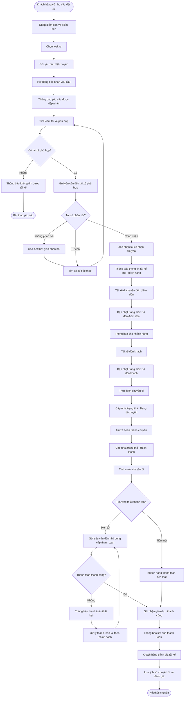

1. Business context & Business problem

  Business context:
Công ty ABC là doanh nghiệp cung cấp dịch vụ đặt xe trực tuyến, phục vụ ba nhóm người dùng chính:
- Khách hàng:
- Tài xế
- Nhân viên vận hành
  
Hiện tại doanh nghiệp đang sử dụng tổng đài và một ứng dụng đơn giản để tiếp nhận yêu cầu đặt xe. Tuy nhiên, nhiều hoạt động quan trọng vẫn phụ thuộc vào xử lý thủ công.

 Business problem:
 
Công ty ABC đang phụ thuộc nhiều vào quy trình đặt xe và phân công tài xế thủ công, hệ thống hiện tại chưa quản lý tập trung và chưa có khả năng mở rộng, dẫn đến khó khăn trong việc phục vụ khách hàng, điều hành chuyến đi, quản lý thanh toán và kiểm soát hoạt động kinh doanh.

2. Stakeholders

| Stakeholder | Vai trò |
|---|---|
| Khách hàng | Đặt xe nhanh, biết trạng thái chuyến, thanh toán và đánh giá |
| Tài xế | Nhận chuyến phù hợp, cập nhật trạng thái, quản lý phương tiện |
| Nhân viên vận hành | Quản lý và giám sát hoạt động đặt xe |
| Ban lãnh đạo | Theo dõi doanh thu, hiệu quả vận hành, báo cáo |
| Business Analyst | Làm rõ nghiệp vụ, yêu cầu và vấn đề còn chưa xác định |
| Nhà cung cấp thanh toán | Xử lý giao dịch thanh toán điện tử |
| Nhà cung cấp thông báo | Cung cấp các kênh gửi thông báo |
| Nhóm phát triển | Phân tích, thiết kế và xây dựng hệ thống |

Stakeholder Matrix mức ảnh hưởng của các stakehoder trong hệ thống

3. Business Goal
- BG01: Tự động hóa quy trình đặt xe và phân công tài xế
- BG02: Nâng cao trải nghiệm khách hàng
- BG03: Nâng cao hiệu quả vận hành
- BG04: Tối ưu hóa việc sử dụng tài xế
- BG05: Quản lý doanh thu và thanh toán tập trung
- BG06: Cải thiện khả năng giám sát và ra quyết định
- BG07: Đảm bảo hệ thống hoạt động ổn định và liên tục
- BG08: Đảm bảo an toàn và bảo mật dữ liệu
- BG09: Đảm bảo khả năng mở rộng của nền tảng
- BG10: Tạo nền tảng linh hoạt cho phát triển trong tương lai

4. Scope(Phạm vi):
   
Phạm vi của dự án CAB System bao gồm việc phân tích, thiết kế, xây dựng và triển khai nền tảng đặt xe phục vụ khách hàng, tài xế và nhân viên vận hành. Hệ thống hỗ trợ quản lý tài khoản, đặt xe, tìm kiếm và phân công tài xế, theo dõi chuyến đi, quản lý vị trí, tính cước, thanh toán, thông báo, đánh giá, quản trị, báo cáo, phân quyền và lưu vết hoạt động. Hệ thống có khả năng tích hợp với các dịch vụ bên ngoài như thanh toán, bản đồ và thông báo nhằm đảm bảo tính linh hoạt và khả năng mở rộng. Các chức năng nâng cao như hệ thống thanh toán riêng, CRM/ERP, AI dự đoán nhu cầu, chương trình điểm thưởng và các dịch vụ vận tải mới chưa thuộc phạm vi của giai đoạn triển khai hiện tại.

5. Business Requirement

| Mã | Business Requirement | Mô tả |
|---|---|---|
| **BR01** | **Quản lý tài khoản** | Hệ thống phải hỗ trợ quản lý tài khoản và thông tin cá nhân của khách hàng, tài xế và nhân viên vận hành. |
| **BR02** | **Đặt chuyến** | Hệ thống phải cho phép khách hàng nhập điểm đón, điểm đến, lựa chọn loại xe và gửi yêu cầu đặt chuyến. |
| **BR03** | **Tìm kiếm và phân công tài xế** | Hệ thống phải tự động tìm và ưu tiên tài xế phù hợp dựa trên vị trí, trạng thái sẵn sàng và các tiêu chí vận hành. |
| **BR04** | **Xử lý phản hồi của tài xế** | Hệ thống phải xử lý trường hợp tài xế chấp nhận, từ chối hoặc không phản hồi và tiếp tục tìm tài xế khác khi cần thiết. |
| **BR05** | **Quản lý chuyến đi** | Hệ thống phải quản lý toàn bộ vòng đời của chuyến từ khi tạo yêu cầu đến khi hoàn thành hoặc hủy chuyến. |
| **BR06** | **Theo dõi vị trí và trạng thái chuyến** | Hệ thống phải hỗ trợ theo dõi vị trí tài xế và cung cấp trạng thái chuyến cho khách hàng và nhân viên vận hành. |
| **BR07** | **Quản lý tài xế và phương tiện** | Hệ thống phải hỗ trợ quản lý hồ sơ tài xế, thông tin phương tiện và trạng thái hoạt động của tài xế. |
| **BR08** | **Tính cước chuyến đi** | Hệ thống phải xác định số tiền khách hàng cần thanh toán dựa trên loại dịch vụ và thông tin chuyến đi. |
| **BR09** | **Thanh toán** | Hệ thống phải hỗ trợ thanh toán tiền mặt và thanh toán điện tử thông qua nhà cung cấp thanh toán bên ngoài. |
| **BR10** | **Quản lý thông báo** | Hệ thống phải gửi thông báo đến khách hàng và tài xế về các sự kiện quan trọng trong quá trình đặt và thực hiện chuyến. |
| **BR11** | **Quản lý lịch sử và đánh giá** | Hệ thống phải lưu lịch sử chuyến đi, thông tin thanh toán và cho phép khách hàng đánh giá tài xế sau chuyến. |
| **BR12** | **Quản lý và giám sát vận hành** | Hệ thống phải cung cấp chức năng để nhân viên vận hành quản lý khách hàng, tài xế, phương tiện và theo dõi các chuyến đang diễn ra. |
| **BR13** | **Quản lý sự cố và giao dịch** | Hệ thống phải hỗ trợ nhân viên vận hành xử lý các chuyến bị lỗi và tra cứu lịch sử giao dịch. |
| **BR14** | **Báo cáo và phân tích hoạt động** | Hệ thống phải cung cấp báo cáo về số lượng chuyến, doanh thu, tỷ lệ hoàn thành, tỷ lệ hủy và hiệu quả hoạt động của tài xế. |
| **BR15** | **Quản lý bảo mật và phân quyền** | Hệ thống phải xác thực người dùng, kiểm soát quyền truy cập và lưu vết các thao tác quản trị quan trọng. |
| **BR16** | **Mở rộng và tích hợp hệ thống** | Hệ thống phải cho phép bổ sung loại dịch vụ, phương thức thanh toán, nhà cung cấp thông báo và các thành phần mới trong tương lai. |

## 6. Business Process

7. Functional Requirement Decompositon

8. Business Rules & Exception

